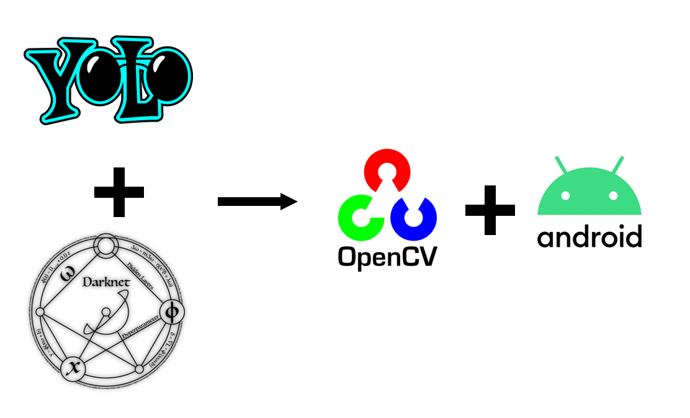

시각장애인을 위한 식사보조 시스템👩‍🦯🍚📱
====
<!-- 작동하는 움짤 넣기 -->

##### 서비스 소개
**시각장애인**은 식사를 할때 보조인이 없을 경우 해당음식이 무엇인지 모르고 
하나 하나 직접 먹어보며 식사를 진행합니다.😢

**본 프로젝트**는 이러한 문제점을 해결하기 위해 **Object Detection**👁 기술을 사용하여 **숟가락**🥄과 **음식**🍱을 인식 후 숟가락이 음식을 가리키면 해당음식의 이름을 **TTS**🔊를 통해 알려주는 서비스 입니다.

여러가지 시도로 거쳐 현재 저장소가 최종본입니다.
 
이전 저장소 링크 : https://github.com/youhavetopay/yolo-android

##### 팀 소개
개인 프로젝트 입니다. 🙋‍♂

-----------

### 1. 시스템 구성도 및 아키텍처 🏗 🛠
</img>  </img>
* Object Detection 모델로는 **YOLOv3-tiny** 사용
* Darknet을 기반으로 학습 후 OpenCV를 통해 Android App 개발
* 사용한 Darknet : https://github.com/AlexeyAB/darknet

### 2. 사용 데이터셋 🍝🍜🍛
</img>
* AiHub에서 제공하는 '**음식 이미지 및 영양정보 텍스트**' 데이터셋 사용
* 직접 촬영한 이미지 사용   
--> 이 둘을 적절히 섞어 사용했습니다.

### 3. 개발 과정🏃‍♂🏁
1. 수집한 데이터셋을 전처리 및 라벨링 진행
2. 수집한 데이터셋을 기반으로 **Darknet 프레임워크**에서 학습 진행
3. 학습이 완료된 가중치 파일(.weight)을 안드로이드에 추가
4. **OpenCV라이브러리**를 통해 가중치 파일을 읽어와 휴대폰 카메라📷에 비치는 이미지를 분석함
5. 분석한 이미지에 따른 감지된 객체의 **Bounding Box** 생성하도록 함
6. 생성된 Bounding Box의 **IOU계산** 후 일정 수치 이상일 경우 TTS 진행하도록 개발 함

### 4.음식 인식 알고리즘 🕵️‍♂️
Object Detection 성능 평가 기준  중 하나인 IOU를 이용했습니다.

</img>

1. 휴대폰의 카메라를 통해 음식과 숟가락 검출
2. 사용자는 숟가락을 이동
3. 이동 중 숟가락과 IOU가 가장 높은 음식 찾기
4. 만약 일정 수치 이상일 경우 사용자는 숟가락으로 해당음식을 가리켰다고 판단
5. 해당음식의 이름을 알려주는 TTS 실행
